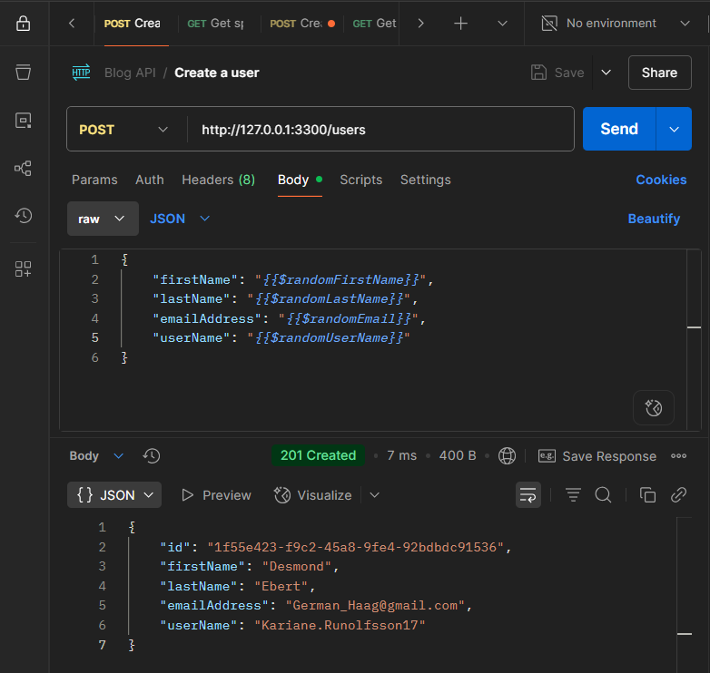
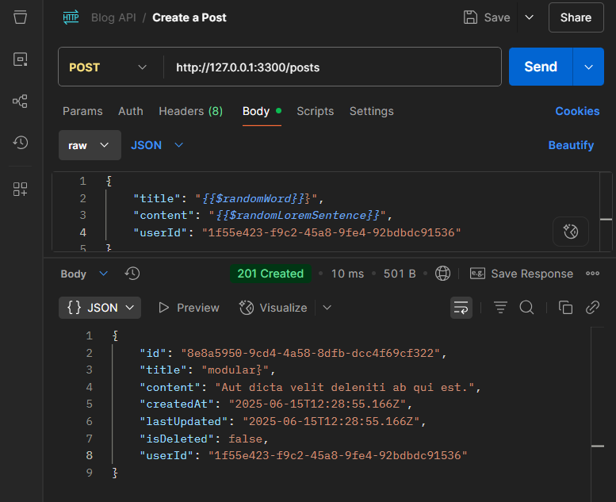

# Blog Post API

This API allows users to create accounts and share blog posts. 

It’s built with **Express JS** for the server, **Prisma ORM** for smooth database interactions, and **PostgreSQL** as the database engine.
I used **ECMAScript Modules (ESM)** syntax to keep things modern and clean.


## Technologies Used

- **Express JS** – Routing and server handling.
- **Prisma ORM** – Managing data models and queries.
- **PostgreSQL** – Database for storing users and posts.
- **Render** – For deploying the API to the cloud. 
- **ECMAScript Modules (ESM)** – Using `import` instead of `require`.
- **Postman** - For testing the API.


## Features
- User registration and retrieval
- Create, read, update, and "soft delete" blog posts
- One-to-many relationship between Users and Posts (one user - many posts)
- Input validation and error handling

## Setup instructions
#### 1. Initialize a new Node.js project
```bash
npm init -y
```
#### 2. Install necessary dependencies
```bash
npm i express
```

#### 3. Install development dependencies
```bash
npm i prisma -D
```
#### 4. Initialize Prisma with PostgreSQL
```bash
npx prisma init --datasource-provider postgresql
```
#### 5. Update the DATABASE_URL in the .env file with your PostgreSQL connection string

#### 6. Define your User and Post models in ***schema.prisma***

```prisma
model User {
  id String @id @default(uuid()) @map("user_id")
  firstName String @map("first_name")
  lastName String @map("last_name")
  emailAddress String @unique @map("email_address")
  userName String @unique @map("user_name")
  posts Post[]
  
  @@map("users")
}
```

```prisma
model Post {
  id String @id @default (uuid()) @map("post_id")
  title String @map("posts_title")
  content String @map("posts_content")
  createdAt DateTime @default(now()) @map("created_at")
  lastUpdated DateTime @updatedAt @map("last_updated")
  isDeleted Boolean @default(false)  @map("is_deleted")
  userId String @map("user_id")
  user User @relation(fields: [userId], references: [id])

  @@map("posts")
}
```
#### 7. Run migrations to create tables in your database
```bash
npx prisma migrate dev --name "create users and posts tables"
```

#### To view your tables using ***Prisma Studio*** GUI, run the command below:
```bash
npx prisma studio
```

## API Endpoints

### Users Endpoints

| Method | Endpoint         | Description                                        |
|--------|------------------|---------------------------------------------------|
| GET    | `/users`         | Fetch all users                                   |
| GET    | `/users/:id`     | Fetch a specific user and all their posts         |
| POST   | `/users`         | Create a new user                                 |

### Posts Endpoints
| Method | Path         | Description                              | 
|--------|--------------|------------------------------------------|
| POST   | `/posts`     | Create new post                          |
| GET    | `/posts`     | Get all active posts and user details    | 
| GET    | `/posts/:id` | Get specific post and user details       |
| PUT    | `/posts/:id` | Update post content                      |
| DELETE | `/posts/:id` | Soft-delete a specific post given post Id|

#### Sample Request and Response – Create User


#### Sample Request and Response - Create Post

